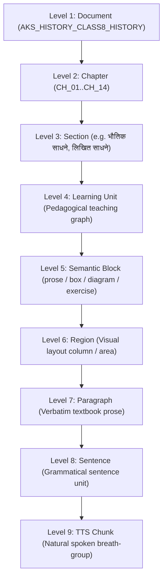

# AksharSetu Corpus Analysis — Class 8 History (Maharashtra State Board, Marathi Medium)

`document_id: AKS_HISTORY_CLASS8_HISTORY` · schema `aksharsetu_narration_v1.0` · source: `History.pdf` (75 PDF pages, 14 chapters, first edition 2018, Balbharati)

This document is the human-readable companion to `corpus_structured.json` (machine-readable) and `page_source_extract.jsonl` (raw per-page text). It provides the full architectural, pedagogical, and narration analysis for the Class 8 History corpus, upgraded to support natural, teacher-like Marathi reading for visually impaired students with 100% textbook fidelity in Reading Mode.

---

## A. Document Manifest & Boundary Verification

| Field | Value | Epistemic Status |
|---|---|---|
| Title | इतिहास (History strand of इतिहास व नागरिकशास्त्र), इयत्ता आठवी | `SOURCE_VERIFIED` |
| Board / Publisher | Maharashtra State Board — Balbharati, Pune | `SOURCE_VERIFIED` |
| Medium | Marathi (मराठी माध्यम) | `SOURCE_VERIFIED` |
| Edition | First edition 2018 | `SOURCE_VERIFIED` |
| PDF Total Pages | 75 (front matter pp. 1–9, textbook content pp. 10–74, back cover p. 75) | `SOURCE_VERIFIED` |
| Printed Page Formula | `printed_page = pdf_page - 9` (verified across all 14 chapters) | `SOURCE_VERIFIED` |
| Total Chapters | 14 (no missing chapters, no overlapping page ranges) | `SOURCE_VERIFIED` |
| Flagship Deep Narration Unit | Chapter 1 (इतिहासाची साधने, PDF pp. 10–13, Printed pp. 1–4) | `SOURCE_VERIFIED` |

Front matter includes the government approval notice (शासन निर्णय), subject-committee credits (acknowledging both History and Civics committees), copyright declaration, table of contents (`अनुक्रमणिका`, p. 8), and learning outcomes (`अध्ययन निष्पत्ती`, p. 9).

---

## B. Complete Chapter Inventory & Boundary Verification (All 14 Chapters)

All 14 chapters have been verified directly against the canonical `History.pdf` page headers, footers, and table of contents:

| # | Chapter Title (मराठी) | PDF pp. | Printed pp. | Genre Pattern | स्वाध्याय Page (PDF / Printed) | Status |
|---|---|---|---|---|---|---|
| 1 | इतिहासाची साधने | 10–13 | 1–4 | Category survey | p. 13 / p. 4 | `SOURCE_VERIFIED` |
| 2 | युरोप आणि भारत | 14–18 | 5–9 | Chronological-thematic | p. 18 / p. 9 | `SOURCE_VERIFIED` |
| 3 | ब्रिटिश सत्तेचे परिणाम | 19–23 | 10–14 | Policy-domain survey | p. 23 / p. 14 | `SOURCE_VERIFIED` |
| 4 | १८५७ चा स्वातंत्र्यलढा | 24–29 | 15–20 | Cause → event → impact | p. 29 / p. 20 | `SOURCE_VERIFIED` |
| 5 | सामाजिक व धार्मिक प्रबोधन | 30–33 | 21–24 | Organization survey | p. 33 / p. 24 | `SOURCE_VERIFIED` |
| 6 | स्वातंत्र्य चळवळीच्या युगास प्रारंभ | 34–39 | 25–30 | Conditions → founding → factions | p. 39 / p. 30 | `SOURCE_VERIFIED` |
| 7 | असहकार चळवळ | 40–44 | 31–35 | Biography-led campaign | p. 44 / p. 35 | `SOURCE_VERIFIED` |
| 8 | सविनय कायदेभंग चळवळ | 45–48 | 36–39 | Flagship campaign + RTCs | p. 48 / p. 39 | `SOURCE_VERIFIED` |
| 9 | स्वातंत्र्यलढ्याचे अंतिम पर्व | 49–53 | 40–44 | Interleaved Quit India & INA | p. 53 / p. 44 | `SOURCE_VERIFIED` |
| 10 | सशस्त्र क्रांतिकारी चळवळ | 54–58 | 45–49 | Regional revolutionary roll-call | p. 58 / p. 49 | `SOURCE_VERIFIED` |
| 11 | समतेचा लढा | 59–64 | 50–55 | Social-movement survey | p. 64 / p. 55 | `SOURCE_VERIFIED` |
| 12 | स्वातंत्र्यप्राप्ती | 65–67 | 56–58 | Constitutional proposal → partition | p. 67 / p. 58 | `SOURCE_VERIFIED` |
| 13 | स्वातंत्र्यलढ्याची परिपूर्ती | 68–70 | 59–61 | Princely-state integration cases | p. 70 / p. 61 | `SOURCE_VERIFIED` |
| 14 | महाराष्ट्र राज्याची निर्मिती | 71–74 | 62–65 | Commission sequence → mass movement | p. 74 / p. 65 | `SOURCE_VERIFIED` |

### Chapter Boundary Integrity Guarantees
1. **Zero Overlap**: Every chapter $N+1$ begins exactly at page $\text{End}(N) + 1$.
2. **Deterministic Offset**: `printed_page = pdf_page - 9` holds true without exception from Chapter 1 (PDF 10 = Printed 1) through Chapter 14 (PDF 74 = Printed 65).
3. **Exercise Anchoring**: The terminal `स्वाध्याय` on each chapter's final page strictly belongs to that chapter. Chapter 1's exercise is on PDF p. 13 (Printed 4), and Chapter 2 begins on PDF p. 14 (Printed 5).

---

## C. Visual PDF Inspection & Content Recovery (Weak / Empty Pages)

Automated text extraction tools (e.g. `pdftotext`) occasionally fail on complex visual layouts. In accordance with the project's source-of-truth hierarchy, rendered PDF pages were visually inspected via high-resolution rasterization to recover lost content.

### 1. Chapter 1: PDF Page 11 (Printed Page 2)
- **Previous Extraction Flaw**: Page extracted as an empty form-feed character (`\f`), breaking digital reader pagination and causing navigation failures.
- **Visual Inspection Findings**:
  - **Column 1 Top**: Memorial text continuation from page 10: `त्या घटनेशी निगडित व्यक्ती इत्यादींविषयी माहिती मिळते. उदा., विविध ठिकाणची हुतात्मा स्मारके.`
  - **Activity Box (Top)**: `करून पहा` box: *"तुमच्या गावातील/शहरातील स्मारके व पुतळे यांविषयी माहिती मिळवा."*
  - **Section 3 (`लिखित साधने`)**: Complete introductory heading and 7-part concept diagram (`वृत्तपत्रे व नियतकालिके, रोजनिशी, पत्रव्यवहार, अभिलेखागारातील कागदपत्रे, सरकारी गॅझेट, टपाल तिकिटे, कोशवाङ्मय`).
  - **Sub-section (`वृत्तपत्रे व नियतकालिके`)**: 2 full paragraphs detailing press under British rule (`ज्ञानोदय`, `ज्ञानप्रकाश`, `केसरी`, `मराठा`, `दीनबंधू`, `अमृतबझार पत्रिका`).
  - **Enrichment Box (`चला जाणून घेऊया`)**: Biographical box on Dr. Babasaheb Ambedkar's journalism (`मूकनायक` 1920, `बहिष्कृत भारत` 1927, `जनता`, `प्रबुद्ध भारत`).
  - **Masthead Graphic**: Visual drawing of the original `बहिष्कृत भारत` front page, featuring Saint Dnyaneshwar's verse: *"आता कोदंड घेऊनी हाती..."*.
  - **Sub-section (`टपाल तिकिटे`)**: Full paragraph explaining postal stamps as historical artifacts.
  - **Sub-section (`नकाशे व आराखडे`)**: Begins at the foot of page 11 (`सर्व्हे ऑफ इंडिया`), flowing seamlessly into page 12 (`अभ्यासण्याच्या दृष्टीने महत्त्वाचे ठरतात. उदा., मुंबई पोर्ट ट्रस्ट...`).
- **Resolution**: All 6 paragraphs, 2 boxes, 1 diagram, and 1 masthead graphic have been transcribed verbatim and integrated into both `page_source_extract.jsonl` and `corpus_structured.json`.

### 2. Chapter 12: PDF Page 66 (Printed Page 57)
- **Previous Extraction Flaw**: Extracted as a 1-line fragment (`\n 57 \f`), flagged as an unverified blank plate.
- **Visual Inspection Findings**:
  - **Section Text**: Two key historical sections:
    1. `हंगामी सरकारची स्थापना` (Establishment of the Interim Government under Pandit Jawaharlal Nehru).
    2. `माउंटबॅटन योजना` (Mountbatten Plan proposing partition).
  - **Full-Page Historical Map**: `स्वतंत्र भारत १५ ऑगस्ट १९४७` (Independent India on 15 August 1947).
    - Color legend: Indian Union (yellow/orange), newly partitioned West & East Pakistan (pink), external boundaries.
    - Foreign colonial enclaves: Portuguese territories (Diu, Daman, Dadra & Nagar Haveli, Goa) and French territories (Mahe, Pondicherry/Puducherry, Karikal, Yanam, Chandernagore).
- **Resolution**: Both text sections and a structured accessibility description of the 15 August 1947 map have been added to the corpus with `SOURCE_VERIFIED` status.

---

## D. Hierarchical Narration Architecture

AksharSetu enforces a strict 9-level structural hierarchy. No layer is flattened:

### Epistemic Status Separation
To preserve absolute integrity, every structural element is explicitly categorized:
1. `SOURCE_VERIFIED`: Verbatim textbook wording or physical layout directly confirmed against the rendered PDF.
2. `TEXTBOOK_SUPPORTED_STRUCTURE`: Section headings, exercise blocks, and printed chapter divisions.
3. `SUPPORTED_INFERENCE`: Pedagogical teaching graph, prerequisites, and learning unit boundaries.
4. `AKSHARSETU_RECOMMENDATION`: Speaking style profiles, pause duration milliseconds, TTS chunk breaks, accessible visual descriptions, and pedagogical transitions.
5. `UNVERIFIED`: Content awaiting manual human verification.

---

## E. Sentence-Level Segmentation & TTS Chunking (Chapter 1 Deep Dive)

Existing paragraph-level segmentation was inadequate for narration, leading to monotonous or robotic playback. AksharSetu now provides full sentence-level segmentation and clause-level TTS chunking.

### Quantitative Summary for Chapter 1
- **Total Canonical Paragraphs**: 20 (including main prose and boxed units)
- **Total Canonical Sentences**: 78
- **Total TTS Chunks**: 116
- **Multi-Chunk Long Sentences**: 36 (46.2% of sentences)
- **Oversized Chunks (>25 words)**: 0
- **Verbatim Fidelity**: 100% (zero words paraphrased, omitted, or altered)

### Handling Very Long Sentences
Sentences exceeding 15 words or containing compound/complex Marathi clauses are segmented into TTS chunks at natural clause boundaries:
- **Causal Connectors** (उदा., `...जावे लागल्यामुळे`, `...धोरण स्वीकारल्यामुळे`)
- **Enumeration Commas** (उदा., `...नाणी, पुतळे आणि पदके`)
- **Subordinate Clauses** (उदा., `...भेट दिल्यावर`, `...शोध लागल्यानंतर`)
- **Contrastive Connectors** (उदा., `काही वास्तू स्मारके आहेत, तर काही...`)
- **Semicolons & Major Pauses** (उदा., `चित्रे उपलब्ध आहेत; परंतु...`)

*Critical Invariant*: The canonical sentence text remains completely untouched. TTS chunks exist purely at the runtime narration layer.

---

## F. Speech Pause Architecture & Timing Defaults

Narration must sound like an empathetic human teacher, not an automated OCR reader. Semantic pause levels are defined with default millisecond ranges:

| Semantic Pause Level | Recommended Range | Default (ms) | Spoken Narration Role |
|---|---|---|---|
| `word_phrase_boundary` | 40–100 ms | 60 ms | Spoken breath group within a clause |
| `clause_pause` | 120–250 ms | 180 ms | Comma, coordinate conjunction, clause boundary |
| `sentence_pause` | 200–350 ms | 280 ms | Marathi full stop (पूर्णविराम) |
| `paragraph_pause` | 400–700 ms | 500 ms | Topic progression within a learning unit |
| `section_transition` | 700–1200 ms | 900 ms | Transition to a new thematic section |
| `major_teaching_transition` | 900–1500 ms | 1200 ms | Conceptual pivot or transition into exercises |
| `question_pause` | 600–1000 ms | 750 ms | Reflective pause following an interactive question |
| `visual_description_pause` | 500–850 ms | 650 ms | Audio framing before/after visual descriptions |
| `title_pause` | 800–1300 ms | 1000 ms | Deliberate introduction pause after titles |

---

## G. Speaking-Style Taxonomy (Operational Profiles)

AksharSetu employs 7 distinct speaking styles configured for Marathi educational delivery:

1. **`historical_narration`** (39 sentences in Ch 1):
   - 130 WPM, 280ms sentence pause, 550ms paragraph pause.
   - Paced delivery with deliberate stress on names, dates, places, and causal connectors.
2. **`explanatory_teacher`** (28 sentences in Ch 1):
   - 115 WPM, 320ms sentence pause, 650ms paragraph pause.
   - Slower, conversational tone emphasizing conceptual definitions and relationships.
3. **`descriptive`** (6 sentences in Ch 1):
   - 125 WPM, 250ms sentence pause, 500ms paragraph pause.
   - Rhythmic delivery designed for category enumerations and source classifications.
4. **`analytical`** (3 sentences in Ch 1):
   - 120 WPM, 350ms sentence pause, 700ms paragraph pause.
   - Deliberate cause-and-effect cadence highlighting critical historiographical evaluation.
5. **`instructional`** (2 sentences in Ch 1 + स्वाध्याय):
   - 110 WPM, 350ms sentence pause, 600ms paragraph pause.
   - Crisp, actionable delivery for student tasks, activities, and questions.
6. **`interrogative`**:
   - 115 WPM, 450ms sentence pause, 800ms paragraph pause.
   - Rising terminal pitch with reflective pauses for interactive check-ins.
7. **`visual_description`**:
   - 105 WPM, 400ms sentence pause, 750ms paragraph pause.
   - Slow, spatially anchored delivery for diagrams, maps, and photographs.

---

## H. Pedagogical Narration Flow & Special Content Elements

### 1. Linear Chapter Narration Flow
Reading Mode follows a 26-step pedagogical sequence:
$$\text{Chapter Title} \longrightarrow \text{Prior Knowledge Bridge} \longrightarrow \text{Physical Sources} \longrightarrow \text{Museum Box} \longrightarrow \text{Statues} \longrightarrow \text{Written Sources} \longrightarrow \text{Ambedkar Box} \longrightarrow \text{Stamps \& Maps} \longrightarrow \text{Oral Sources} \longrightarrow \text{Powada Activity} \longrightarrow \text{Audiovisual Sources} \longrightarrow \text{Synthesis \& Preservation} \longrightarrow \text{Exercise Closure}$$

### 2. Box Handling (`माहीत आहे का तुम्हांला?` & `करून पहा`)
Informational boxes do not abruptly interrupt the prose. AksharSetu introduces them with gentle pedagogical transitions:
- *Transition In*: "विद्यार्थी मित्रांनो, आता आपण पाठ्यपुस्तकातील एका विशेष माहितीच्या चौकटीकडे वळूया: [शीर्षक]."
- *Verbatim Box Prose*: Read according to its speaking style.
- *Transition Out*: "ही झाली [विषय] माहिती. आता आपण पुन्हा मुख्य पाठाकडे वळूया."
*(Both transitions are explicitly tagged as `AKSHARSETU_RECOMMENDATION`.)*

### 3. Visual Content (Photos, Diagrams, Mastheads, Maps)
- **Photographs** (e.g. Aga Khan Palace): Set to `ON_DEMAND`. Accessible spatial description provided upon user request.
- **Concept Diagrams** (e.g. Written Sources, Oral Sources): Read hierarchically (central concept followed by radial child nodes in clockwise/logical order).
- **Historic Mastheads** (e.g. *Bahishkrut Bharat*): Detailed typographic and cultural description provided on demand.
- **Historical Maps** (e.g. Ch 12 Partition Map): High-level orientation first (title, territory colors), followed by key strategic enclaves upon student inquiry.

### 4. स्वाध्याय (Assessment Unit)
Exercises are strictly segregated from the normal reading flow (`narration_policy: EXCLUDE_FROM_NORMAL_READING`). When the student completes the chapter, AksharSetu offers interactive self-assessment across 5 distinct exercise formats:
1. Multiple Choice Questions (योग्य पर्याय निवडा)
2. Reasoned Explanations (सकारण स्पष्ट करा)
3. Short Notes (टीपा लिहा)
4. Concept Map Completion (संकल्पना चित्र पूर्ण करा)
5. Practical Extension Projects (उपक्रम)

---

## I. Reading Mode vs. Tutor Mode Architectural Boundary

| Dimension | Reading Mode (वाचन पद्धती) | Tutor Mode (मार्गदर्शक पद्धती) |
|---|---|---|
| **Textbook Fidelity** | 100% Verbatim textbook prose | Grounded explanations, analogies, Q&A |
| **Model Generation** | Zero rewriting, zero hallucinated text | Allowed for answering queries, bounded by LU |
| **Narration Policy** | Continuous lesson following pedagogical flow | Interactive, conversational check-ins |
| **Accessibility Cues** | Spoken headings, box transitions, pause cues | Structural summaries, vocabulary clarifications |
| **Source Provenance** | Resolves to exact paragraph, page, sentence | Every explanation references source LU and page |

---

## J. Provenance Tracking & Verification Guarantee

Every narratable sentence and audio chunk maintains a strict, unbroken 8-level provenance chain:
$$\text{document\_id} \to \text{chapter\_id} \to \text{page\_id} \to \text{region\_id} \to \text{learning\_unit\_id} \to \text{paragraph\_id} \to \text{sentence\_id} \to \text{tts\_chunk\_id}$$

This guarantees that a student or educator can instantly locate any spoken sentence on the authentic physical textbook page.
